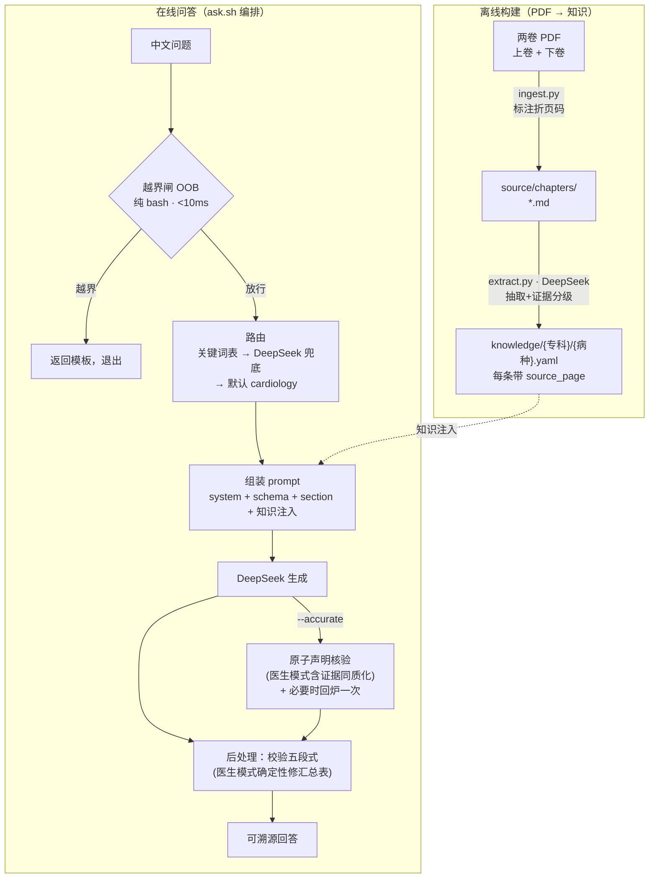

# 西氏内科学精要 · 内科问答 Agent

> 面向 **患者/家属** 与 **临床医生** 双受众的中文内科学循证问答智能体。
> 每一条结论都可溯源到《西氏内科学精要》(Cecil Essentials of Medicine) 的**印刷页码**。

`覆盖全书 126 章` · `18 个专科` · `评测 患者 39.2 · 医生 38.5 / 40` · `答案可溯源到页码` · `Python + Bash`

---

## 一分钟看懂（无需医学或算法背景）

**遇到的问题**：直接拿医学问题去问通用大模型，它可能编出一段听起来很专业、其实查无实据的答案
（业内叫「幻觉」）；而且同一个问题，**患者想听人话、医生想看证据**，深度需求完全不同。

**这个项目怎么做**：把一本权威内科教材整本拆成一张张「带页码的知识卡片」存进仓库。用户提问时——

1. 先用**关键词规则**判断这问的是哪个专科、哪种病（不调用大模型，纯文本匹配，毫秒级）；
2. 把对应的几张知识卡片**原样塞给大模型**，要求它「只能照着卡片讲、并标出处页码」；
3. 最后检查答案是不是按规定的小节格式写的、页码对不对。

> **一句话**：不是让大模型「凭记忆作答」，而是**先替它把书翻到正确那一页，再让它照着讲清楚**——
> 于是每句结论都能一句句翻回书里核对。

---

## 核心概念（先读这 4 个词）

后面会反复用到，先用大白话讲清楚，读起来就不卡了（更全的解释见文末[名词速查](#附录名词速查)）：

- **溯源**：答案里每条结论都能**翻回原书的具体页码**核对，而不是大模型自己「想」出来的。这是本项目的头号目标。
- **幻觉**：大模型一本正经地**编造**看似可信、其实查无实据的内容。「溯源」就是用来压制幻觉的。
- **RAG / 向量库**：当下让大模型「带着资料作答」的主流技术（把资料切碎、按语义相似度捞回最像的几段）。
  本项目**刻意不用**它，改用更可控的「关键词规则 + 整段知识卡片」——为什么，见[为什么这样设计](#为什么这样设计)。
- **越界**：超出「科普问答」边界的请求（比如要手术决策、化疗剂量、让它替你确诊）。系统会**直接拦下来给模板**，
  绝不硬答。

---

## 看它怎么答

同一类问题，患者模式说「人话」、医生模式给「证据」。以下两段均为**真实评测输出（节选）**，
都按固定的五段格式组织。

### 案例 ① 患者模式 — 评测 38/40

```bash
./bin/ask.sh "我爸有高血压，平时饮食要注意什么？"
```

```text
【这是什么】
高血压（血压持续≥140/90 mmHg）是心脑血管事件的首要危险因素。合理饮食可降低收缩压
5-10 mmHg，是药物治疗的重要辅助，不能替代药物。

【日常该怎么做】
- 严格限盐：每天食盐降至约 6 克（约一啤酒瓶盖）；注意酱油、腌菜、外卖里的"隐形盐"。
- 多摄入钾：多吃新鲜蔬果（如菠菜、番茄、香蕉）。
- 控制体重、戒烟限酒；具体运动方案需医生按病情制定。
- 家庭血压监测：每天早晚各测一次，记录后就诊时带给医生。

【什么情况要就医】
- 血压≥180/120 mmHg 且伴头痛、视力模糊或胸痛 → 立即就医或拨打 120
- 服药期间出现持续干咳或头晕 → 告知医生，不要自行停药

【常见误区】
❌"血压正常了就可以停药" → ✓ 正常是药物起效的结果，多数高血压需终身管理。
❌"低盐就是做菜少放盐" → ✓ 酱油、味精、外卖里的隐形钠同样要控制。

【依据】
《西氏内科学精要》第 177、181 页（高血压定义与分级、生活方式改善）
```

> 注意安全边界：答案**不给**具体降压药名与剂量（属越界），并反复强调「不可自行停药」。

### 案例 ② 医生模式 — 评测 36/40

```bash
./bin/ask.sh --mode doctor "老人反复尿路感染，怎么预防复发？"
```

```text
【定义与流行病学】
反复发作 UTI 定义为一年内≥3 次或半年内≥2 次（高级别证据）。老年人因绝经后雌激素下降、
前列腺增生、免疫功能下降，风险显著增高（高级别证据）。

【循证管理】
- 绝经后女性每日局部使用阴道雌激素，可降低复发风险（中级别证据）。
- 性活动相关复发，可性生活后单次口服抗生素预防（高级别证据），药物按当地耐药情况选择。
- 复杂性 UTI 必须依据尿培养及药敏选药，并处理基础疾病（中级别证据）。
- 多饮水、不憋尿等生活方式干预，现有证据不能有效预防复发（中级别证据）。

【红旗症状/转诊指征】
- 发热、寒战、腰痛、恶心呕吐 → 立即就医（提示肾盂肾炎）（高级别证据）
- 老年患者出现意识模糊、低血压 → 立即就诊（中级别证据）

【证据等级汇总】
| 等级       | 条目数 | 代表来源                      |
|------------|--------|-------------------------------|
| 高级别证据 | 3      | 《西氏内科学精要》第 991、992 页 |
| 中级别证据 | 3      | 《西氏内科学精要》第 991、992 页 |

【参考】
- 《西氏内科学精要》第 990-992 页（尿路感染分类、危险因素、诊断与预防、治疗）
```

> 两套五段格式的差异，正是「双受众」的核心：患者拿到的是可执行的生活建议，
> 医生拿到的是带证据等级的循证要点 + 一张可核对的【证据等级汇总】表。

---

## 它答得准不准

我们准备了 **183 道标准考题**（按专科分层抽样），让另一个大模型当「考官」逐题打分，四项各 10 分：
**覆盖度 / 准确性 / 安全性 / 溯源**。目标线是平均 **≥ 85%（即 34/40）**。下表为最近一轮**全量**评测：

| 模式 | 题数 | 通过率 | 覆盖 | 准确 | 安全 | 溯源 | 总分 |
|------|:---:|:---:|:---:|:---:|:---:|:---:|:---:|
| **患者问答** | 144 | **98.6%** | 9.4 | 9.9 | 9.9 | **10.0** | **39.2 / 40** ✓ |
| **医生问答** | 128 | **96.1%** | 9.1 | 9.8 | 9.8 | 9.9 | **38.5 / 40** ✓ |

> 两种模式总分均稳定越过 34/40 目标线；溯源项接近满分（强溯源是硬约束）。患者模式题量更多，
> 是因为部分共用考题在两种受众下各计一次、而少数医生专属考题不计入患者模式。
> 完整原始结果见 `eval/results/`；评分脚本见[构建与评测](#构建与评测)。

---

## 为什么这样设计

几条与众不同、也是这个项目最花心思的地方：

- **不用 RAG，改用「确定性路由 + 整段知识注入」**：提问先经关键词规则定位到具体专科与疾病，
  再把对应的整张知识卡片喂给模型。好处是可控、可复现、不会出现向量检索那种「捞回不相干段落」的漂移。
- **强溯源是硬约束，不是口号**：每条知识都钉在书的具体页码上，并有**自动审计在每次提交时强制校验**——
  页码必须落在该疾病所属章节的范围内，否则**直接判定不通过、挡住合并**。
- **保留书里的真实证据等级**：抽取时连同书中的「证据等级（高/中/低）」「推荐强度（强推荐/推荐/可考虑）」
  一起保存；医生模式还会专门汇总成一张【证据等级汇总】表。这张表**不交给模型去手数**——它是正文证据标注
  的确定性函数，由脚本按正文逐级计数后重写（零额外调用、幂等），杜绝「汇总和正文对不上」的低级错误；
  另外若医生答案把各条证据**一刀切标成同一等级**，精确模式会自动回炉、要求逐条按书中等级重标。
- **两条可自由组合的开关**：*受众*（患者 / 医生，切换语气和小节结构）× *精度*（快速单次 / 加一道自查回炉）。
- **越界请求毫秒级拦截**：手术决策、化疗剂量、要求确诊等超纲请求，由纯规则在 10 毫秒内拦下并返回模板，
  根本不进入生成环节——既省钱，又守住安全底线。

---

## 架构

> 以下进入技术细节。两条管线：离线把「书」变成「结构化知识」，在线把「问题」变成「可溯源回答」。



> 不支持 mermaid 的查看器，可读作：
> **离线** `PDF → ingest.py → 章节 MD → extract.py → 病种 YAML`；
> **在线** `问题 → 越界闸 → 路由 → 组装提示词(注入知识) → 生成 →(精确模式核验回炉)→ 后处理 → 回答`。

名词对照：**OOB**＝越界闸；**folio / 折页码**＝书印刷出来的页码（区别于 PDF 物理页）；
**源页 `source_page`**＝每条知识标注的折页码，也是溯源审计对齐的目标。

---

## 快速开始

```bash
# ① 安装依赖（极简：仅 pymupdf + pyyaml）
pip install -r requirements.txt

# ② 配置唯一的外部依赖：DeepSeek API 密钥
cp .env.example .env                             # 把密钥填进 .env 的 DEEPSEEK_API_KEY

# ③ 提问
./bin/ask.sh "我爸有高血压，平时饮食要注意什么？"
./bin/ask.sh --mode doctor "高血压的血压控制目标是多少？"
./bin/ask.sh --accurate "肺栓塞的抗凝怎么做？"
./bin/ask.sh --domain cardiology:hypertension --debug "..."
```

> 注：书的 PDF 与抽取出的 `source/` 为本机私有、**不随仓库分发**（见 `.gitignore`）；
> 自行问答只需 `knowledge/` 中已抽取好的 YAML + 一个 DeepSeek API 密钥。

### 命令行参数速查（`ask.sh`）

| 参数 | 含义 |
|------|------|
| `--fast` | **默认**。单次生成，最低延迟 |
| `--accurate` / `--deep` | 把答案拆成原子声明逐条核验 + 必要时回炉自纠（降幻觉，约 2–3 倍调用） |
| `--mode patient \| doctor` | 受众模式（默认 `patient`；与精度模式可自由组合） |
| `--domain 专科:病种` | 强制领域，跳过自动路由（如 `cardiology:hypertension`） |
| `--stream` | 流式输出（生成时逐字实时显示，默认关） |
| `--debug` | 把路由与请求负载信息打印到标准错误（stderr） |

---

## 构建与评测

```bash
# ① 构建知识库（ingest 不调用 API；extract 调用 DeepSeek）
python3 bin/ingest.py --all                      # 两卷 PDF → 章节 Markdown（页码审计依赖此产物）
python3 bin/extract.py --specialty cardiology    # 章节 Markdown → 病种 YAML 知识卡片

# ② 闸门检查（进入评测前必须全部通过，一条命令跑全）
./bin/check.sh                                   # 路由 · 溯源 · 抽样溯源 · 结构 · 冒烟，共五项审计
./bin/check.sh --with-oob                        # 额外跑越界拦截评测（消耗 API）

# ③ 评测
./bin/eval.sh --mode both --concurrency 8        # 跑完整的 183 题标准考题
./bin/eval_deep.sh                               # 精确模式（核验 + 回炉）
./bin/eval_oob.sh                                # 越界拦截评测
```

「考官打分」的实现：`eval/judge_prompt*.md`（评分细则）+ `bin/parse_judge.py`（解析分数）；
标准考题在 `eval/gold.yaml`。其中**强溯源审计** `audit_grounding_sample.py` 会强制每条知识的页码
落在该疾病所属章节的折页范围内（±2 容差），否则该项审计不通过。

---

## 项目结构

```text
bin/            管线脚本：ingest/extract（Python）+ ask/router/build_prompt/check/eval（Bash）+ 各 audit_*.py 闸门
knowledge/      18 个专科目录，每个病种一份 *.yaml（带 source_page）；外加 chapters.yaml 清单
                ├─ {专科}/{病种}.yaml      病种知识（主体）
                ├─ {专科}/guidelines/      指南注入（按 guideline_name 键）
                └─ {专科}/safety_floor/    第三层安全兜底知识
prompts/        system_*.md · output_schema_*.md · sections/{专科}.md · oob_templates*.md
schema/         sections.yaml —— 五段式小节标题的唯一真源
eval/           gold.yaml（183 例）· oob_gold.yaml · judge_prompt*.md · results/
source/         章节 Markdown（ingest 产物，已被 git 忽略）
pdfs/           两卷原书 PDF（私有，已被 git 忽略）
```

18 个专科：`cardiology` · `respiratory` · `digestive` · `renal` · `endocrine` · `hematology` ·
`oncology` · `neurology` · `rheumatology` · `infectious` · `bone_mineral` · `geriatrics` ·
`palliative` · `perioperative` · `substance_use` · `mens_health` · `womens_health` · `molecular`。

---

## 设计取舍

- **为什么不用 RAG**：单一权威书源 + 中文同源（无需翻译）+ 「结论必须落到页码」的硬约束，使得
  「确定性路由 + 整段知识注入」比向量检索更可控、更可审计，也没有 chunk（切片）切分带来的语义漂移。
- **折页地板 `FOLIO_MIN=2`**：全书第 1 章「人类疾病的分子基础」从印刷页 2 起。地板若误设为 10，会丢掉
  ch1 前几页的折页标注，导致 `molecular` 条目页码审计失败。
- **病种 ↔ 章节 1:1**：页码溯源以此为前提。一个病种横跨多章时（如 肝炎 vs 肝硬化）需拆成不同病种文件，
  否则页码闸会失败。
- **数据私有**：原书 PDF 受版权保护，不分发；运行问答需自备书（用于重新 ingest/extract）或直接复用
  仓库内已抽取的 `knowledge/`，并自备 DeepSeek API 密钥。

---

## 附录：名词速查

承重术语已在开头「[核心概念](#核心概念先读这-4-个词)」用大白话讲过，这里是完整版——左边的词在正文里出现过，右边是解释。

| 名词 | 一句话解释 |
|------|------------|
| **RAG / 向量库** | 主流做法：把资料切碎、转成向量，提问时按「语义相似度」捞回最像的几段再让大模型参考。本项目**刻意不用**，改用关键词规则直接定位整章知识。 |
| **溯源 / grounding** | 答案里的每条结论都能指回原书的**具体页码**，可逐句核对，而不是大模型自己「想」出来的。 |
| **幻觉（hallucination）** | 大模型一本正经地编造看似可信、其实不存在的内容。强溯源就是用来压制它的。 |
| **路由（routing）** | 判断「这个问题属于哪个专科 / 哪种病」，从而决定喂哪几张知识卡片。本项目用关键词表，毫秒级、不花钱。 |
| **折页码 / folio** | 书**印刷出来的页码**（书页角上印的那个数字），区别于 PDF 的物理页序。溯源对齐的就是它。 |
| **OOB（out-of-bounds，越界）** | 超出「科普问答」边界的请求（如要手术决策、化疗剂量、确诊），系统直接拦下来给模板，不硬答。 |
| **gold 集** | 人工准备的「标准考题」集合（本项目 183 题），用来量化评测系统答得好不好。 |
| **LLM-judge** | 用另一个大模型按评分细则给答案打分（覆盖/准确/安全/溯源四项），实现自动化评测。 |
| **核验 + 回炉（`--accurate`）** | 生成后把答案拆成一条条小声明，逐条回去 grep 知识卡片核对；对不上就让模型重写一次。医生模式还会在证据等级被「一刀切」时一并回炉。 |
| **证据等级汇总确定性修复** | 医生模式的【证据等级汇总】表由脚本按正文标注逐级计数后重写（零额外调用、幂等），不靠模型手数，避免「表与正文对不上」。 |
| **DeepSeek** | 本项目调用的大模型服务，是唯一的外部依赖（需自备 API 密钥）。 |

---

> 工程细节、命令全集与各种「坑」的来龙去脉，见 [`CLAUDE.md`](./CLAUDE.md)。
